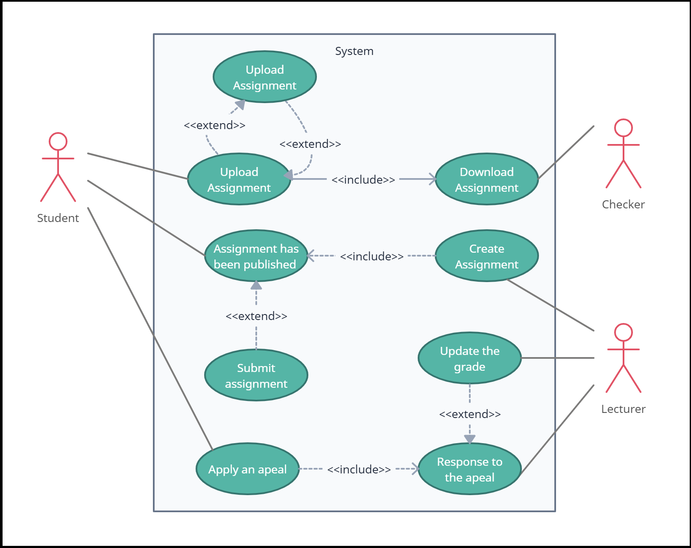

# iCheck.

## Description
iCheck. is a student assignment management system designed as a web application to streamline the process of managing student assignments. It provides three different levels of permissions: one for students, one for assignment checkers, and one for lecturers. Each permission level has its own authentication and offers distinct functionality tailored to its users' needs. The application utilizes Firebase Realtime Database for data storage and management.

## Authors
- [Dor Shir](https://github.com/Dorshir)
- [Bar Alayof](https://github.com/barmud3)
- [Itamar Kuznitsov](https://github.com/Itamar-Kuznitsov)
- [Shachar Ketz](https://github.com/Shachar97)

## Table of Contents
- [Description](#description)
- [Authors](#authors)
- [Features](#features)
- [Installation](#installation)
- [Usage](#usage)
- [UML Diagrams](#uml-diagrams)
- [Contributing](#contributing)
- [License](#license)

## Features
- **Authentication**: Secure authentication system for students, assignment checkers, and lecturers.
- **Role-based Access Control**: Different functionality and permissions based on user roles.
- **Student Dashboard**: Interface for students to submit assignments and view feedback.
- **Assignment Checker Interface**: Tools for assignment checking, including reviewing and providing feedback.
- **Lecturer Dashboard**: Management tools for lecturers to oversee assignments and grading.
- **Firebase Realtime Database Integration**: Utilizes Firebase for efficient data storage and synchronization.
- **Material-UI (MUI)**: UI library for React components.

## Installation
1. Clone the repository: `git clone <repository-url>`
2. Install dependencies: `npm install`
3. Configure Firebase Realtime Database: Create a Firebase project and set up Realtime Database according to your application's requirements.
4. Configure Authentication: Set up Firebase Authentication to authenticate users based on their roles.
5. Run the application: `npm run dev`
6. Access the application locally: Visit [http://localhost:5173/](http://localhost:5173/) in your browser.

## Usage
1. **Student Usage**: Students should log in with their credentials and access the dashboard to submit assignments.
2. **Assignment Checker Usage**: Assignment checkers can log in to review and provide feedback on submitted assignments.
3. **Lecturer Usage**: Lecturers can log in to manage assignments, view submissions, and grade assignments.

### Test Accounts
- **Student Account**: 
  - Email: student@gmail.com
  - Password: 123123
- **Assignment Checker Account**: 
  - Email: checker@gmail.com
  - Password: 123123
- **Lecturer Account**: 
  - Email: lecturer@gmail.com
  - Password: 123123

## UML Diagrams

### Use Case Diagram

### Activity Diagram

### Sequence Diagram

## Contributing
We welcome contributions from the community. If you have any ideas for improvements or would like to report a bug, please submit an issue or a pull request following our [contribution guidelines](CONTRIBUTING.md).

## License
This project is licensed under the [MIT License](LICENSE).
